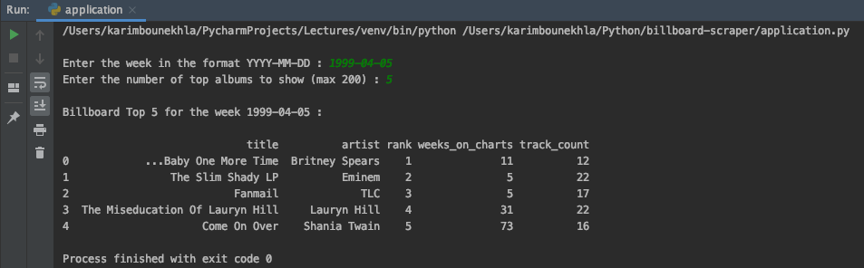

# billboard-scraper

Tool in Python that scraps the [Billboard Top 200](https://www.billboard.com/charts/billboard-200) and reads in album metadata from [MusicBrainz](https://musicbrainz.org/)

To display more metadata from MusicBrainz, consult the [Development API](https://musicbrainz.org/doc/Development/JSON_Web_Service) page.

How to Use:
- Enter the week in the format YYYY-MM-DD (1963-08-17 to Present)
- Enter the number of top albums to show (1 - 200)

## Tools 

* Python 3.7.3 - The Back-End
* BeautifulSoup4 / Requests

## Screenshots

## Getting Started

These instructions will get you a copy of the project up and running on your local machine for development and testing purposes. 

### Prerequisites

You will need Python 3.x and the following libraries and packages. Type commands in terminal to install:

`pip install BeautifulSoup4`

`pip install numpy`

`pip install pandas`

`pip install requests`

`pip install urllib3`

### Installing

Download the `application.py` file into a folder. Ensure that all imported libraries in are installed on your machine or virtual environment.

Modify the `inc` field in the `getMetadata()` method to include more metadata in the JSON if you would like - consult the [Development API](https://musicbrainz.org/doc/Development/JSON_Web_Service) for information.

Run the program on your machine or virtual environment.
